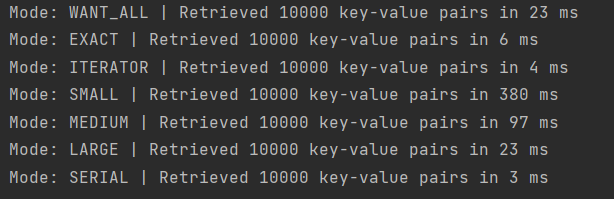
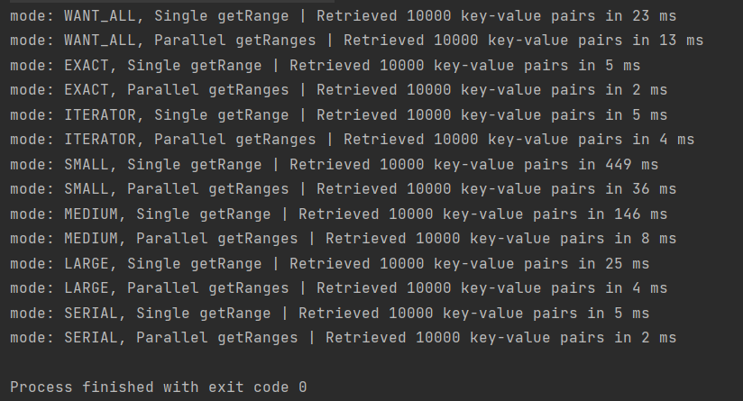
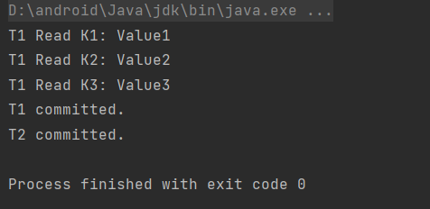
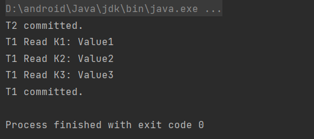
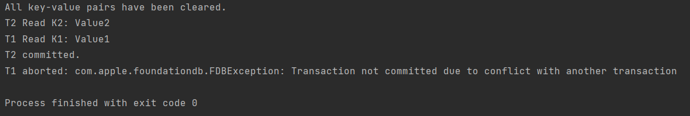

# Learning about fdb

### Task 5: Measure single getrange performance

As we can see from the results, SERIAL mode took the shortest execution time and SMALL mode took the longest.
### Task 6: Compare single getrange vs multiple getranges sent in parallel

As we can see from the results, in all, parallel is far more efficient than single. It's more obvious in SMALL, MEDIUM modes. 
Since the two modes usually took longer time compared to other modes.
### Task 7: Understand read snapshot
 

From the above results, we can see that if T1 committed before T2, none of the two transactions will be aborted. Since T1
read before T2's update. If T2 committed before T1, none of the two transactions will be aborted, too. T1 will read a consistent snapshot.
### Task 8: Understand transaction conflict

This is a deadlock scenario. So, one of the two transactions will be aborted. For example, when T1 tried to commit, 
it will be aborted because it was trying to read K1 while T2 has a lock on it (due to the update operation). 
